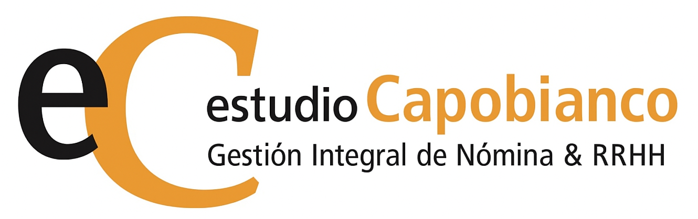

[](./assets/img/logo-o-apaisado.png)

# **Estudio Capobianco - Landing Page Oficial 🚀**

Este repositorio contiene el código fuente de la landing page oficial de **Estudio Capobianco**, una firma de servicios profesionales especializada en Gestión Integral de Nómina y RRHH para empresas en Argentina. La página está diseñada para captar clientes B2B directos, establecer credibilidad y ofrecer una experiencia de usuario fluida y profesional.

<br>

## **Descripción del Proyecto 💼**

La landing page de Estudio Capobianco fusiona la experticia contable en liquidación de sueldos y cargas sociales con la gestión estratégica de Recursos Humanos. El sitio web sirve como un punto central para la interacción con clientes potenciales, ofreciendo información clara sobre nuestros servicios, casos de éxito, un blog con contenido de valor y una herramienta de consulta con IA para preguntas frecuentes. La página está optimizada para la generación de leads, la construcción de autoridad de marca y una excelente experiencia en cualquier dispositivo.

<br>

## **Características Principales ✨**

- **Diseño Profesional y Responsivo:** 📱 Adaptable a dispositivos de escritorio, tablets y móviles, con una estética limpia y elegante.
- **Navegación Fluida:** 🧭 Un encabezado fijo y un menú hamburguesa para móviles que permiten una navegación intuitiva y rápida entre secciones.
- **Sección de Servicios Estratégicos:** 📊 Detalle de las áreas clave: Liquidación de Sueldos y Cargas Sociales, Asesoría Laboral y Prevención de Litigios, y Gestión Estratégica de Recursos Humanos.
- **Propuesta de Valor Única:** 💎 Destaca la sinergia entre la Contaduría (Verónica Capobianco) y la Licenciatura en RRHH (Camila Kacic) como un diferencial clave.
- **Testimonios de Clientes:** ⭐ Prueba social de clientes satisfechos, con comentarios concisos y enlaces a perfiles de LinkedIn.
- **Blog Integrado:** 📚 Enlace directo a nuestro blog externo, con una descripción de los temas de valor que ofrece (noticias, legislación, calculadoras, guías).
- **Formulario de Contacto Directo:** ✉️ Un formulario principal para que los interesados soliciten consultas personalizadas.
- **Asistente IA Flotante:** 🤖 Un botón lateral de "Consulta IA ✨" que despliega un panel donde los usuarios pueden hacer preguntas generales y obtener respuestas rápidas, con campos de captación de leads (Nombre y Email).
- **Footer Completo:** 📍 Información de contacto detallada (redes sociales con iconos, email, WhatsApp con icono y número) y un enlace al domicilio en Google Maps, junto con la información de copyright.

<br>

## **Tecnologías Utilizadas 💻**

- **HTML5:** 📄 Estructura semántica del contenido.
- **Tailwind CSS:** 🎨 Framework CSS para un desarrollo rápido y un diseño responsivo.
- **JavaScript (Vanilla JS):** 💡 Para la interactividad (menú móvil, panel IA, auto-ajuste de textareas, formularios).
- **Font Awesome:** 🖼️ Biblioteca de iconos para elementos visuales.
- **Google Fonts:** ✒️ Fuentes 'Lora' (serif) y 'Open Sans' (sans-serif) para una tipografía armoniosa.
- **Gemini API (gemini-2.0-flash):** 🧠 Integración para la funcionalidad de consulta de IA.

<br>

## **Instalación y Configuración (Uso Local) 🛠️**

Para clonar este repositorio y ejecutar el proyecto en tu máquina local:

1. **Clona el repositorio:** 📥
   ```bash
   git clone https://github.com/veritocapito/ec.git
   ```
1. **Navega al directorio del proyecto:** 📁
   ```bash
   cd ec
   ```
1. **Estructura de Archivos:** 📂 Asegúrate de que tus archivos de imagen (logo-apaisado.jpg, logo.jpg, logo-o-black.png, veronica.png, camila.png) estén ubicados en la ruta ./assets/img/ relativa a index.html.
   ```bash
   ├── index.html
   ├── assets/
   │   ├── styles.css
   │   ├── main.js
   │   └── img/
   │       ├── logo-apaisado.jpg
   │       ├── logo.jpg
   │       ├── logo-o-black.png
   │       ├── veronica.png
   │       └── camila.png
   └── README.md
   ```
1. **Abre index.html:** 🌐 Simplemente abre el archivo index.html en tu navegador web preferido.

<br>

## **Uso 🚀**

La landing page es intuitiva y está diseñada para la interacción del usuario:

- **Navegación:** 🧭 Utiliza el menú del encabezado para desplazarte por las secciones. En dispositivos móviles, activa el menú hamburguesa.
- **Formulario de Contacto:** 📝 Rellena el formulario en la sección "Contacto" para enviar una consulta.
- **Consulta a Nuestros Expertos IA:** 💡 Haz clic en la pestaña flotante "IA" en la esquina inferior derecha para abrir el panel de consulta. Ingresa tu nombre, email y pregunta para interactuar con nuestro asistente de IA.
- **Blog:** 📖 Haz clic en el botón "Acceder al Blog" en la sección de Blog para visitar nuestro sitio de contenidos.
- **Redes Sociales y Ubicación:** 🔗 Utiliza los iconos en el pie de página para conectar con nosotros en redes sociales, enviar un correo electrónico, comunicarte por WhatsApp o ver nuestra ubicación en Google Maps.

<br>

## **Licencia 📜**

Este proyecto está bajo la licencia MIT. Consulta el archivo [LICENSE](https://d.docs.live.net/8A7680A070EAC478/Documents/LICENSE) para más detalles (si tienes un archivo LICENSE, si no, puedes eliminar esta línea).

<br>

**Contacto y Soporte 📞**

Si tienes alguna pregunta o necesitas soporte, no dudes en contactarnos a través de nuestro formulario de contacto en el sitio web o en nuestras redes sociales:


- **WhatsApp:** 📲 +54 11 3215-8576
- **Email:** 📧 info@estudiocapobianco.com.ar
- **Instagram:** 📸 [@estudio_capobianco](https://www.instagram.com/estudio_capobianco/)
- **LinkedIn:** 💼 [Verónica Capobianco](https://www.linkedin.com/in/vscapobianco/)
